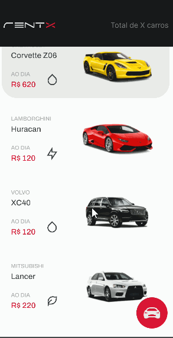

<h1 align="center">
  
</h1>

<p align="center">
</p>

<p align="center">
  <a href="#information_source-how-to-use-server">ℹ️ How To Use</a>&nbsp;&nbsp;&nbsp;|&nbsp;&nbsp;&nbsp;
  <a href="#rocket-technologies-server">🚀 Technologies</a>&nbsp;&nbsp;&nbsp;|&nbsp;&nbsp;&nbsp;
  <a href="#computer-author">💻 Author</a>&nbsp;&nbsp;&nbsp;

</p>

<p align="center">
The rentx app made from the mobile module rocketseat classes.
</p>


# Mobile
<h1 align="center">
  
</h1>


# :information_source: How To Use

Clone the repository

```bash
https://github.com/williamjayjay/rentx-cars-RN
```

```bash
# Install the dependencies
yarn

# Run json server api
yarn api

# Run the application
yarn android
```

# :rocket: Used libraries

- [Styled-Components](https://styled-components.com/)
- [React-Native-SVG](https://github.com/react-native-svg/react-native-svg)
- [React-Native-iphone-x-helper](https://github.com/ptelad/react-native-iphone-x-helper)
- [React-Native-Calendars-version:1.505](https://www.npmjs.com/package/react-native-calendars)
- [MomentJS](https://momentjs.com/)
- [Date-fns](https://www.npmjs.com/package/date-fns)
- [Axios](https://axios-http.com/docs/intro)
- [React-Navigation](https://reactnavigation.org/)
- [TypeScript](https://www.typescriptlang.org/)
- [React-native-svg-transformer](https://github.com/kristerkari/react-native-svg-transformer)
- [Json-Server](https://styled-components.com/)
- +@Types

<br />

---
# :computer: Author

<table>
  <tr>
    <td align="center">
      <a href="http://github.com/williamjayjay/">
        
        <br />
        <sub>
          <b>William Gomes</b>
        </sub>
       </a>
       </td>
     
    

  </tr>
</table>
<br />
