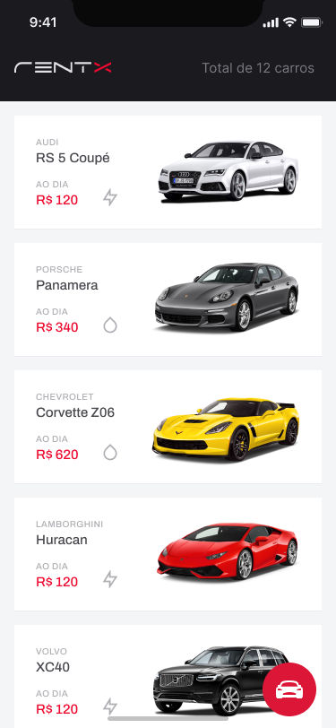
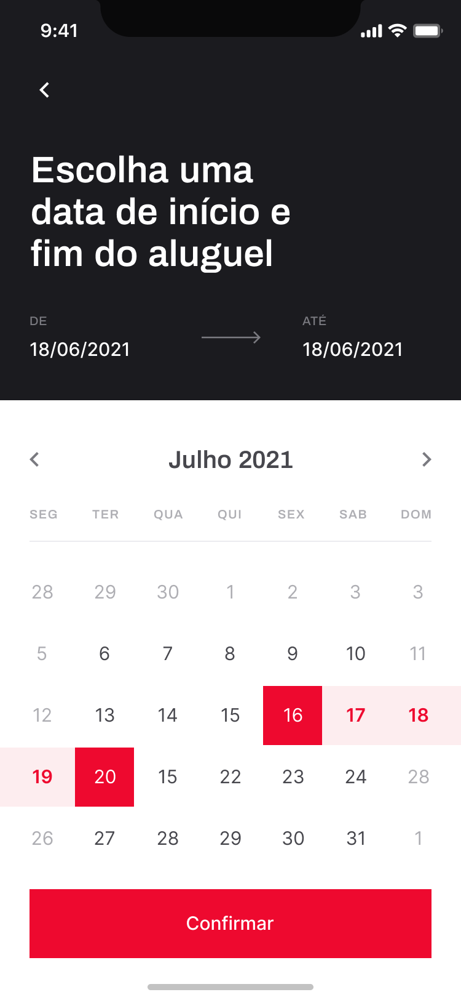

<h2 align="center">
	
</h2>

## 💻 Sobre o projeto

O Rentx foi desenvolvido durante a trilha de React Native no Ignite da Rocketeseat. O projeto é baseado em um app de aluguel de carros.

## 🛠 Tecnologias

Algumas das ferramentas que foram usadas na construção do projeto:

- [Expo][expo]
- [TypeScript][typescript]
- [Styled Components][styledcomponents]
- [React Native Reanimated][rnreanimated]
- [Lottie][lottie]

## 🎨 Layout

  
  
  
  
  

[expo]: https://docs.expo.dev/
[typescript]: https://www.typescriptlang.org/
[styledcomponents]: https://styled-components.com/
[rnreanimated]: https://docs.swmansion.com/react-native-reanimated/
[lottie]: https://docs.expo.dev/versions/latest/sdk/lottie/
